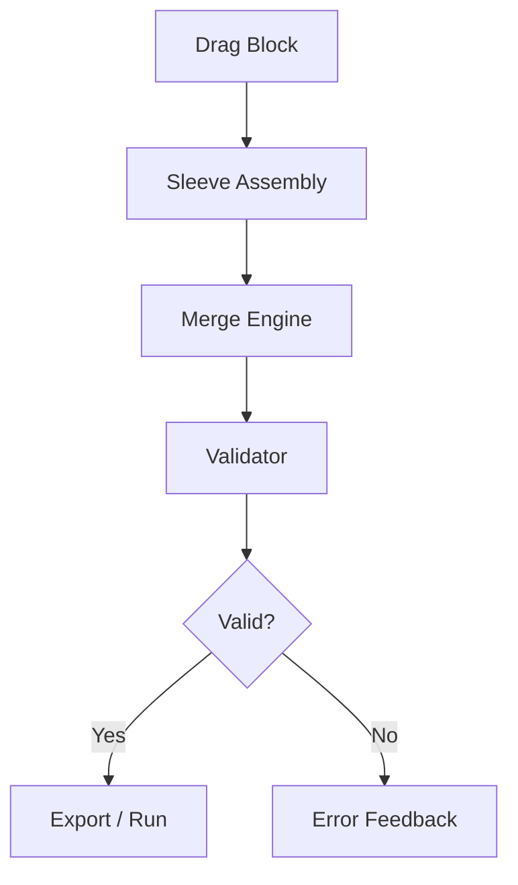

# Citadel Flow

This document maps the end‑to‑end flow of data through the **UMG Citadel** block builder.

## Pipeline

1. **Block Selection**
   - The user drags blocks from the library (sourced from `/public/umg_blocks/`).
2. **Sleeve Assembly**
   - Blocks snap into vertical stacks and can be grouped into purple *sleeves*.
3. **Merge Pass**
   - `src/utils/mergeEngine.js` merges stacked blocks, resolving conflicts via MOLT priority.
4. **Validation Pass**
   - Cantocore + Ledger schema checks ensure structural integrity.
5. **Export / Runtime**
   - The validated sleeve is exported as HTML, JSON, or executed live in Bolt.

## Sequence Diagram (text)

## Notes

- Trigger blocks can short‑circuit the flow and force immediate export.
- The validator writes any issues to the Ledger for later review.
- Future versions will support real‑time collaborative sleeves.
